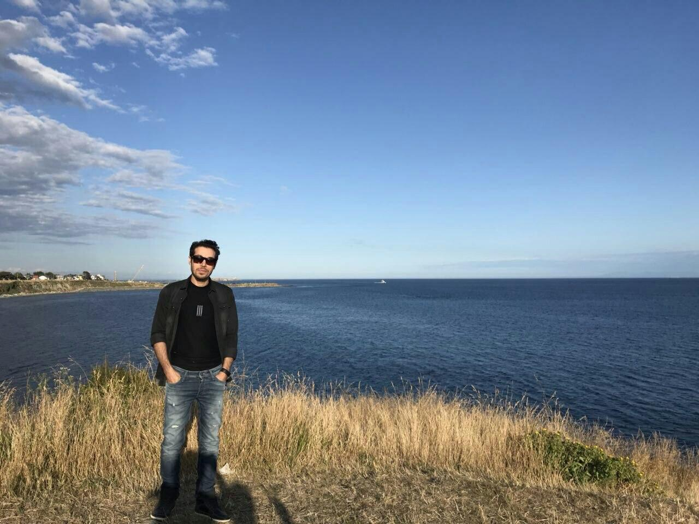

## About

A Machine/Deep Learning enthusiast and researcher for anomaly detection and classification. 

Actively try to keep up to date and learn new approaches in this field.
 

I am currently a PhD student at University of Victoria (Electrical & Computer Engineering).
 

I have a Master in Computer Engineering-Artificial intelligence.
 

## Contact

**Other**: [Github](https://github.com/faamir), [Google Scholar](https://scholar.google.com/citations?user=wxG4QuUAAAAJ&hl=en), [LinkedIn](https://www.linkedin.com/in/amir-farzad-78930481/) 